## **Project 4: WineByMe**

### **Contents** 
* [Overview](#overview)
* [The Brief & Timeframe](#the-brief--timeframe) 
* [Technologies used](#technologies-used) 
* [App Flow](#app-flow)
* [The Planning & Development Process](#the-planning--development-process)
* [Wins & Challenges](#wins--challenges)
* [Known Bugs](#known-bugs)
* [Future Enhancements](#future-enhancements) 
* [Key Learnings](#key-learnings)

### **Overview**
---

WineByMe is an application for wine enthusiasts. You can sign up, log in, and browse many wines by classification. You can create your own “wineNight” to store the wines of interest. 

This group project was built with GA classmates [Ivan Craig](https://github.com/ic188002) & [Rob Sesemann](https://github.com/Rob-Sesemann).

**Code Access** 
The frontend source code on GitHub [here](https://github.com/HelenevB/SEI-project04-wineApp-Frontend) 
The backend source code on GitHub [here](https://github.com/HelenevB/SEI-project04-wineApp-Backend)

**Deployment** 

The link to the deployed application via Heroku is [here](https://wineappsei66.herokuapp.com/).

To explore the full features Forage has to offer,  feel free to log in using the following credentials: 

**Username**: demo@email.com  
**Password**: testpassword 

### **The Brief & Timeframe**
---
* A working MERN full-stack, single-page application hosted on Heroku
* Have a well-styled interactive front-end
* Communicate with the express backend via AJAX 
* Implement token-based authentication. Including the ability for a user to sign-up, log in & log-out
* Implement authorisation by restricting CUD data functionality to authenticated users.  
* Navigation should respond to the login status of the user
* Have a well-scoped feature-set

### **Technologies used**
---

* MongoDB/Mongoose
* Express
* React
* Nodejs
* React-Bootstrap 
* Ajax 
* CSS 

**Third-Party API’s**

* Spooncular API

### **App Flow**
--- 

Main Index – list of wine classification, which can be filtered by red & white

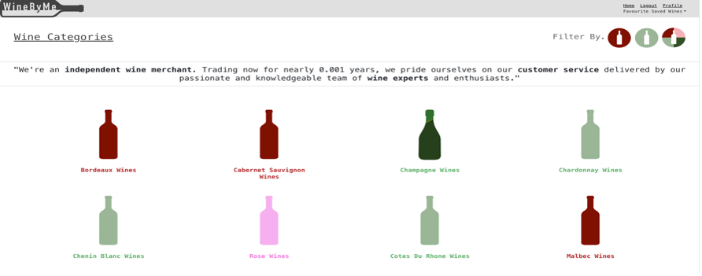

Users can click on a wine classification and see the wine available.  They can click on a particular wine.  If they have a “wineNight’ created, they can select to add it to one of them. 
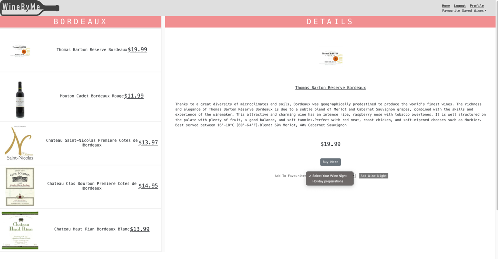

If users have yet to create a wineNight, they can create one. All ‘wineNights’ created will display on a user's favourite Wine List. 

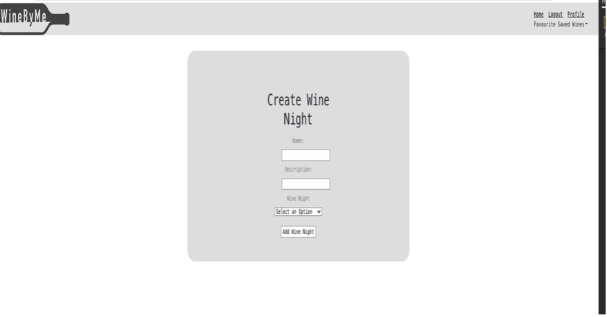 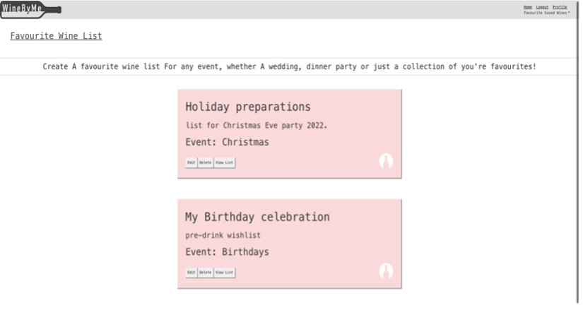

Their user can view and remove wines from a “wineNight”, edit the “wineNight”, or delete it entirely.

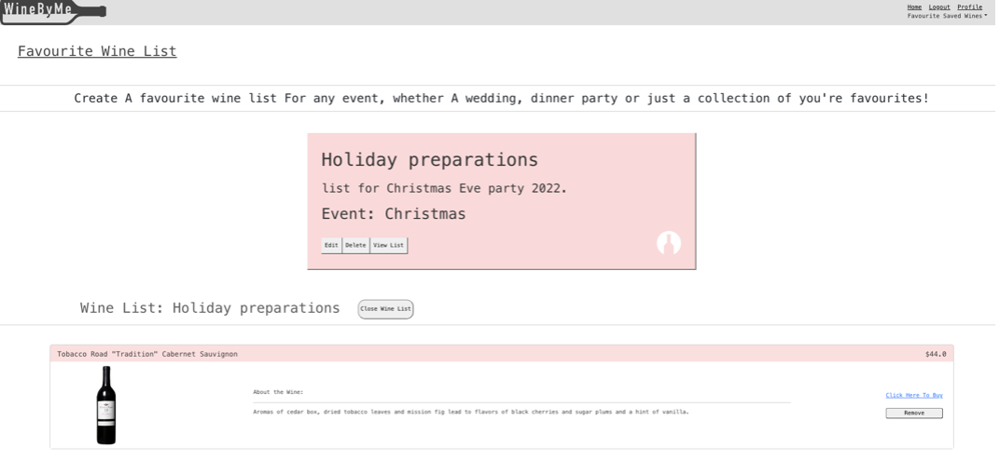

**Functionality** 

* Sign-up and log in, log-out 
* Create, view, update and delete your “wineNights”
* Add & remove wines from each “wineNight.”
* View a list of all available wines and details for each

### **The Planning & Development Process**
--- 

The idea for WineByMe came from our team leader Ivan; ahead of the project, he had been exploring possible APIs that could be incorporated into a project, one of which was spooncular API. Whilst the API was predominately offering data for food nutrition, there was a wine section we could use to our advantage.

 This would have been the first project in which I utilised a third-party API, so I was excited to incorporate this into the development. 

Once we got to grips with what the spooncular API had to offer, we sketched out our initial ERD to map out the relationship between our models: 

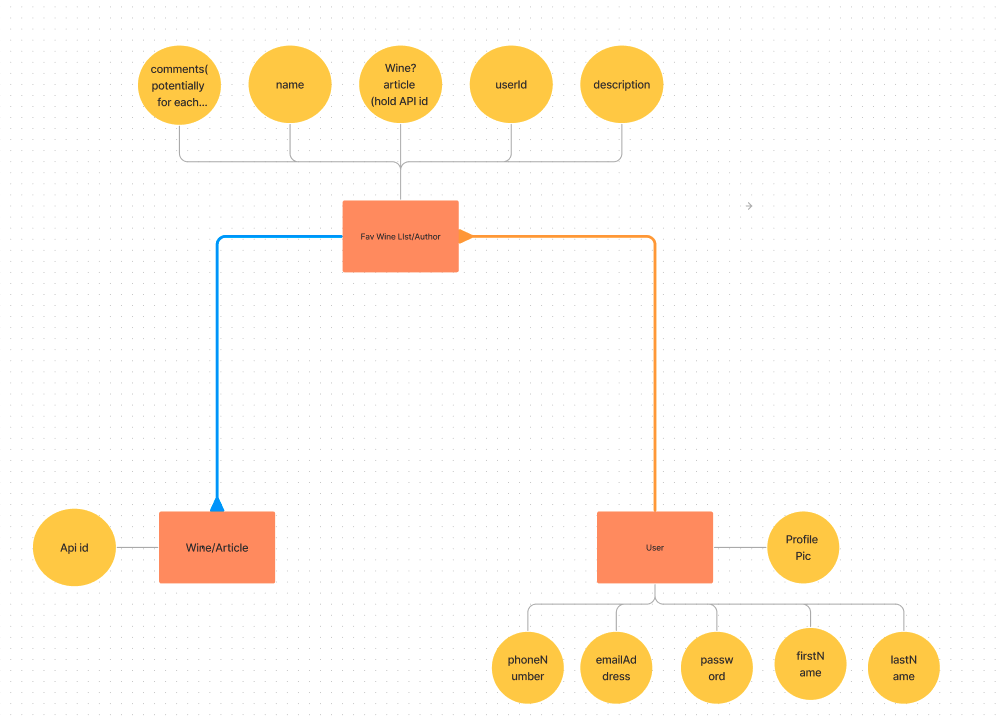

We established for our application it would be best for: 

1. The “user” has a one-to-many relationship with ‘’favourite wines”. 
2. “favourite wines” to have a one-to-many relationship with “wines”.

We discussed the flow of the app, and Ivan drew up the initial wireframe of the index page. 

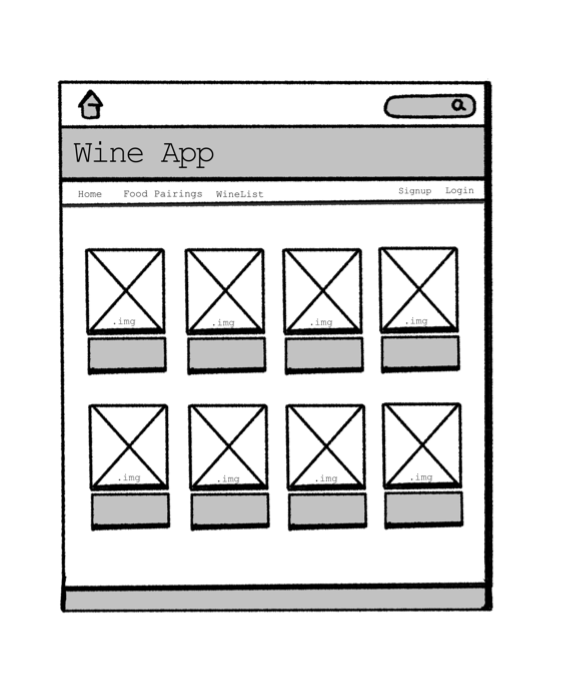

Once we had the structure for the site in place, the last task was to divide the workload. It was at this stage that we agreed that we would pair-program. Whilst we were all familiar with the backend development, having used express and MongoDB in project 2, we’d only be working on the React framework for six days; given its complexity, we felt the screen sharing would be the most effective way to consolidate our learning and achieve our goal of producing a well-rounded functioning app.  Therefore “pair-programmed” throughout the whole build process, with two of us working from one laptop (via zoom share screen)  to build each element and the third working on CSS and the design. 

Considering this, Trello was not crucial in keeping track of each of our workloads, but we did use it to keep track of the features we were building.

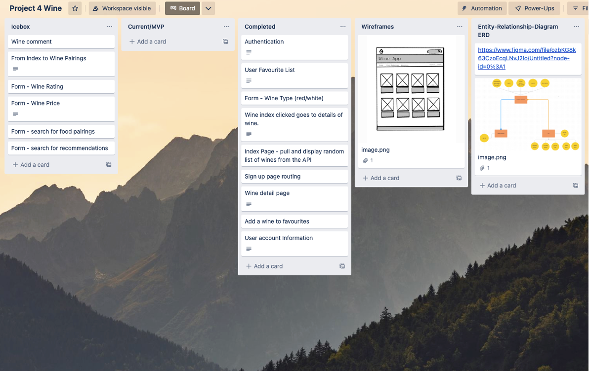

Our approach for the week was methodical. We worked on each feature from the backend, first creating the routes and controllers for each as we tackled them. We’d then test the API worked with the postman and then move forward to integrating the API in the front-end. The flow of the work week for the build was as follows: 

* Sign-up, Sign-in, and log functionality 
* Wine Index
* Wine List & Wine Details page 
* Create, Edit, Update and Delete WineNights functionality 
* Filter function for Wine Index
* Add and Remove wines from “wineNights.” 
* App flow 

**Featured Code** 

The wine index was a crucial part of the site as the ‘’on-click” of each wine classification would take you to a wine list rendered by the spooncular API. The API we worked with took two parameters, the wine classification, i.e., chardonnay and the number of wines we wanted to render  

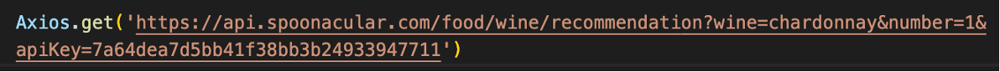

We started by hardcoding each wine classification into the API, and from this, we successfully rendered the index page (as it looks now). However, the code was repetitive and not in line with React's best practices by having one component that could be rendered multiple times. We knew we had to refactor our code to be more dynamic. 

The visual from the index helped to break down the requirements:  We could see we had one ‘div” (wineIndex) that held multiple ‘div’ (one for each wine classification). Therefore, to render correctly, we established we’d need the following:

1. A data set to loop through, created within our application based on the spooncular classification list 

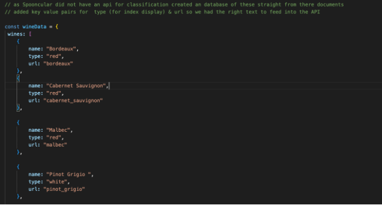

2. “wineIndex” component – where we pass through the wine classification data as a prop (wineCategories) 
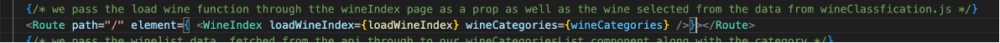

3. “wineCard’ component

Within the wineIndex.js, we’d map over the wine classification data and return a wine card for each category listed in the data, which is then displayed. 

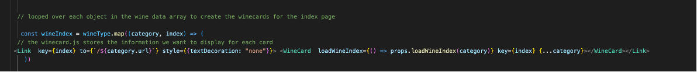

Now we had a dryer and more dynamic code; it was time to make sure that ‘on-click’ a list of wines for that classification would capture the correct data to display a list of wines. 

This was done within the ‘loadWineIndex’ function as noted below:

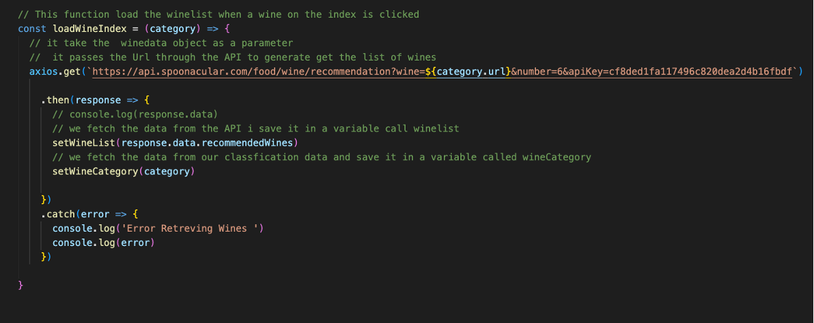

The data fetched from the API was passed through  our “WineCategorieslist “component as a prop named “wineList.”
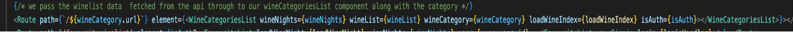

 Which is then passed through to the “WineList” component
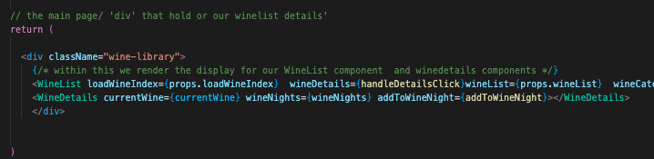

Within the wineList component, the array of wine data fetched from the API (for the classification clicked on the index )  is mapped through to render an individual row for each wine in the array, as shown below for Bordeaux’s

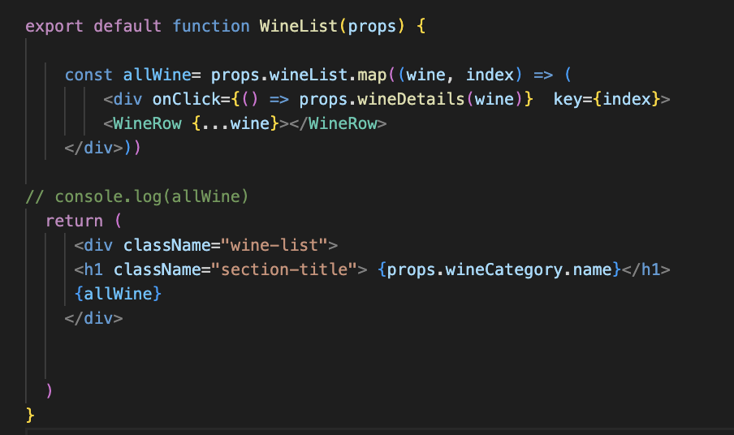 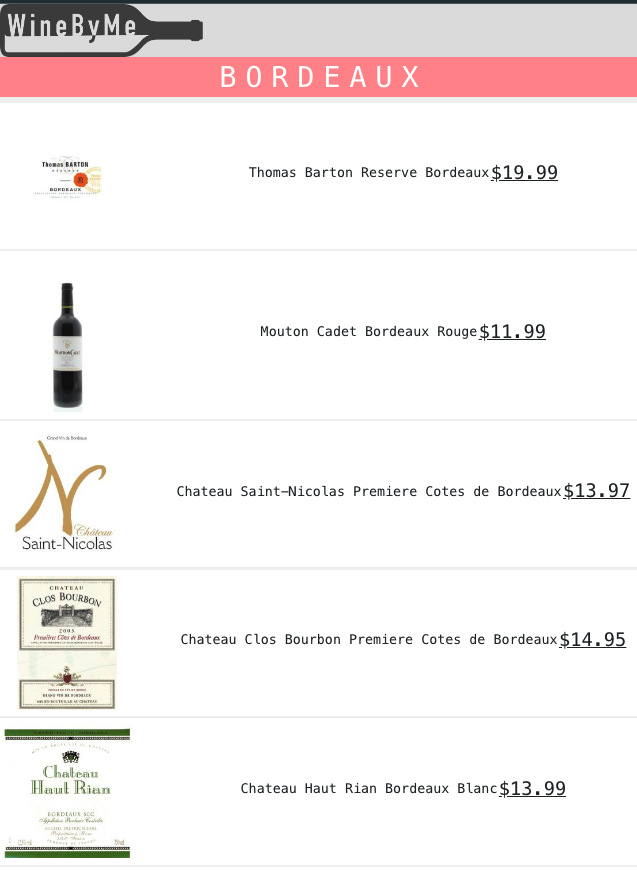

I’ve highlighted this code section as it was pivotal in completing the final product. The process helped us grasp the concept of React. The methodology we used to refactor the code was how we approached the development of the rest of the features. This made the development of the project smoother. 

### **Wins & Challenges**
--- 

Working in such a supportive and collaborative group was the biggest win. The benefits of pair programming were demonstrated in the execution of our final product. We only focused on a few features, but the finished product felt cohesive and complete. We could learn from each other, bounce ideas off each other, and talk through challenges. 

Another success for me was feeling more confident with working in the backend. In project 2, I struggled to grasp some of the concepts of relationship data, whereas, for this project, I was able to get the data saved in the right place as intended relatively quickly.

Aside from the challenges above, it took some time within React to get the App flowing smoothly.  When looking to redirect to another component after form submission, I initially tried to use the link, but the data was not saving when I did. Having done some research and found that calling upon the useNavigate Hook did the trick.

### **Known Bugs**
--- 
 
* A new instance of the wine is created in the database every time a user chooses to add it to a wine list. 
* Users who are not logged in still have access to the add-to wineNight functionality. 
* App Messaging – the user is currently not notified if a wine has successfully been added to the list 
* The user profile section is showing but not complete (this was not a priority) 

### **Future Enhancements**
--- 

* Complete the user’s profile 
* Have a wine-pairing feature 
* Option to filter the winelist for each classification by price & rating 

### **Key Learnings**
---

The key learning I have taken away from Project 4 is simply not to be afraid to code even if I feel the initial approach is “wrong”’. On this project, we got our initial ideas and thought processes down, giving us a visual view of what we wanted to achieve, and making it easier for us to refine. This process allowed me to consolidate my understanding, as each time we made a refinement, I knew why we were making it.  I now truly feel empowered to work through my thought process (even if it takes time) instead of seeking the “DRY” solutions from the offset.  

